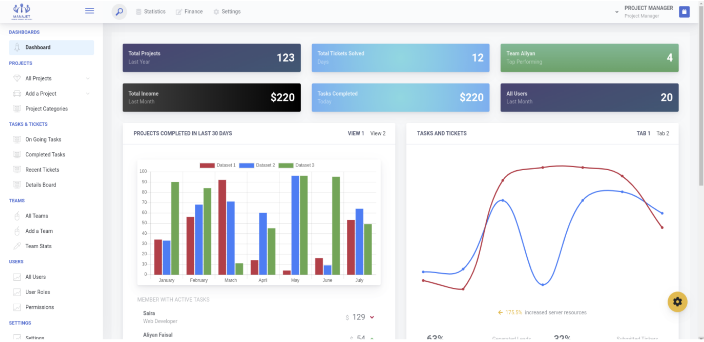
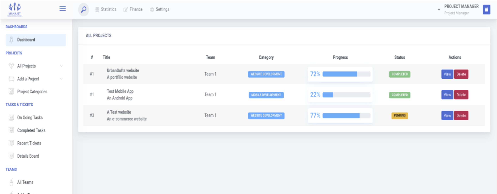
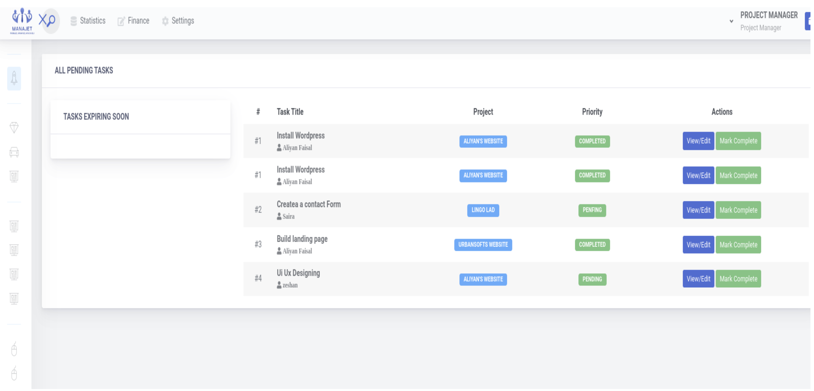
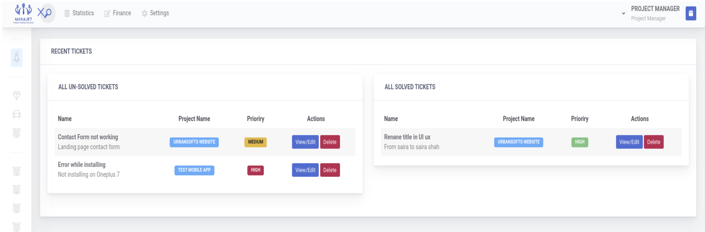
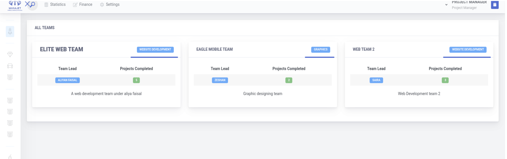
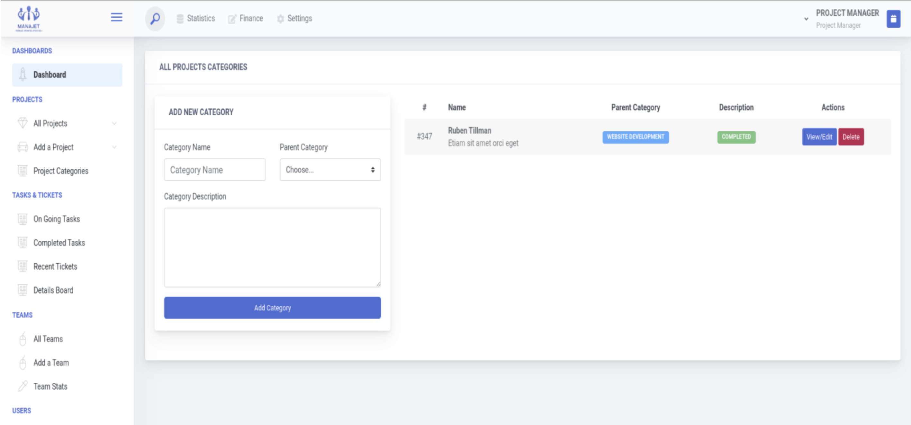

# ManaJet – AI-Integrated Project Management System

> *Mobilize, Organize, and Excel* — A smart project management platform built for small and mid-sized IT companies.



---

## Overview

ManaJet is a web-based project management system designed to help IT companies streamline how they plan, assign, and track software projects. Built as a Final Year Project (2023–2024), it integrates OpenAI's API to assist project managers with automated task planning, timeline generation, and budget estimation — reducing manual overhead and letting teams focus on development.

The platform targets small and mid-sized software houses that need structured project workflows without the complexity or cost of enterprise tools.

---

## Key Features

- **AI-Assisted Project Planning** — Integrates OpenAI API to auto-generate task breakdowns, development timelines, and preliminary budget estimates from a project description
- **Project & Task Management** — Create projects, assign teams, track task progress with real-time status updates (Ongoing / Completed / Pending)
- **Team Management** — Organize developers into teams, assign team leads, and monitor team-level performance and project completion stats
- **Ticket System** — Clients and team members can raise tickets for bugs or change requests; managers resolve and track them from a unified dashboard
- **Finance Tracking** — Monitor project budgets and income at a glance from the main dashboard
- **Role-Based Access Control** — Separate access levels for Project Managers, Team Members, and Clients
- **Analytics Dashboard** — Visual charts for projects completed, tasks and tickets over time, and member activity

---

## Tech Stack

| Layer | Technology |
|---|---|
| Backend | PHP (Laravel Framework) |
| Frontend | Blade Templating Engine, HTML/CSS/JS |
| Database | MySQL |
| AI Integration | OpenAI API (GPT) |
| Auth & Roles | Laravel Sanctum / Custom RBAC |

---

## AI Integration Details

ManaJet uses the **OpenAI API** to assist project managers at the planning stage:

- **Task Breakdown Generation** — Given a project title and description, the system generates a structured list of development tasks
- **Timeline Estimation** — AI suggests realistic sprint timelines based on task complexity
- **Budget Estimation** — Preliminary cost estimates generated from project scope inputs
- **Workflow Structuring** — Generates ordered development workflows to guide team execution

This reduces the time managers spend on initial project scoping and provides a structured starting point for execution.

---

## Screenshots

| Dashboard | Projects |
|---|---|
|  |  |

| Task Management | Ticket System |
|---|---|
|  |  |

| Team Management | Project Categories |
|---|---|
|  |  |

---

## System Architecture

```
Client Request
     │
     ▼
Laravel Router → Controller → Service Layer
                                   │
                    ┌──────────────┼──────────────┐
                    ▼              ▼               ▼
               MySQL DB      OpenAI API      Blade Views
             (Projects,     (Task/Timeline   (Dashboard,
            Tasks, Teams,    Generation)      Reports)
             Tickets)
```

---

## Project Context

This system was developed as a **Final Year Project** at Karakoram International University (2023–2024) with a focus on practical application of AI-assisted decision support in software project management workflows.

**Problem addressed:** Small IT companies often lack structured project management tooling, leading to missed deadlines, poor resource allocation, and low client transparency.

**Solution:** A lightweight, AI-augmented platform that brings structure to project execution without requiring expensive enterprise software.

---

## Author

**Aliyan Faisal**
BS Information Technology — Karakoram International University
[GitHub](https://github.com/aliyanfaisal) · [Email](mailto:aliyanfaisal15@gmail.com)
# ManaJet
